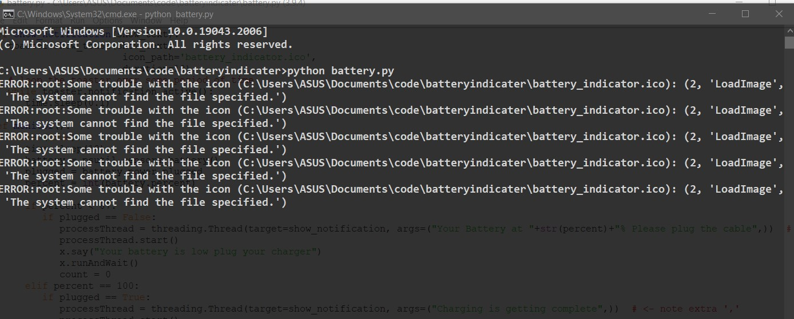

# Battery Indicator Using Python
A simple Battery Notifier application using Python. A battery notifier is a simple application that produces a notification message and ask to plug your charge every 10 second unless you plug you charger on the desktop.


## Deployment

After installing python in your sysytem run the following command :-

```bash
  pip install psutil
```

```bash
  pip install pyttsx3
```
```bash
  pip install win10toast
```
## Screenshots



